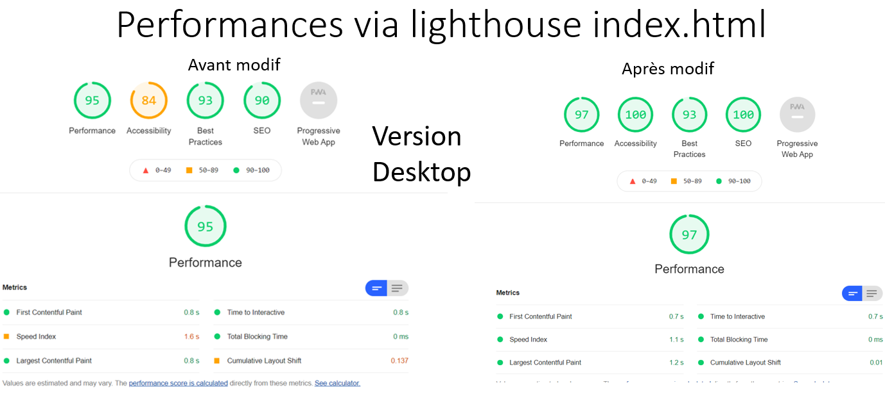
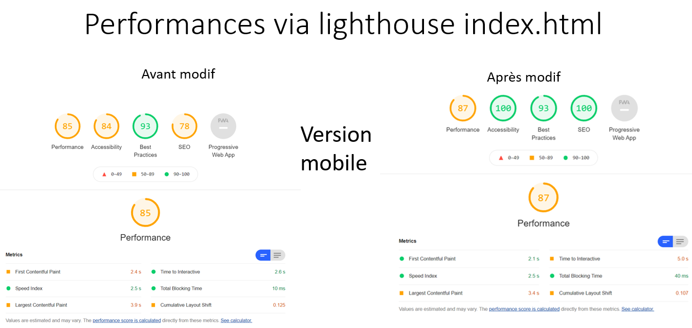
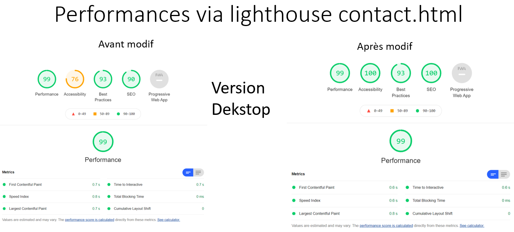

# Optimiser le SEO et l'accessibilité du site web : 
## La Chouette Agence

🛠️ Utilisation de bonnes et récentes pratiques en développement web

🛠️ Assurer l'accessibilité du site web

🛠️ Écrire un code HTML et CSS maintenable

🛠️ Optimiser la taille et la vitesse d’un site web

🛠️ Optimiser le référencement d'un site web

### Objectifs

- Analyse de l’état actuel de SEO du site fourni
- 10 recommandations pour améliorer le SEO du site
- Amélioration du SEO du site
- Accessibilité du site web
- Comparaison des résultats

### Site web avant modification, et lien vers le code de ce site web avant modification : 

https://oliviercos.github.io/La-Chouette-agence-Default-/

https://github.com/OlivierCos/OlivierCostel_4_DefaultVersion

### Site web après modification : 

https://oliviercos.github.io/Website-Optimization-SEO-Accessibility/

  
  

### &nbsp;   &nbsp; Résultats
 

</img>

#

</img>

#

</img>

#

</img>

